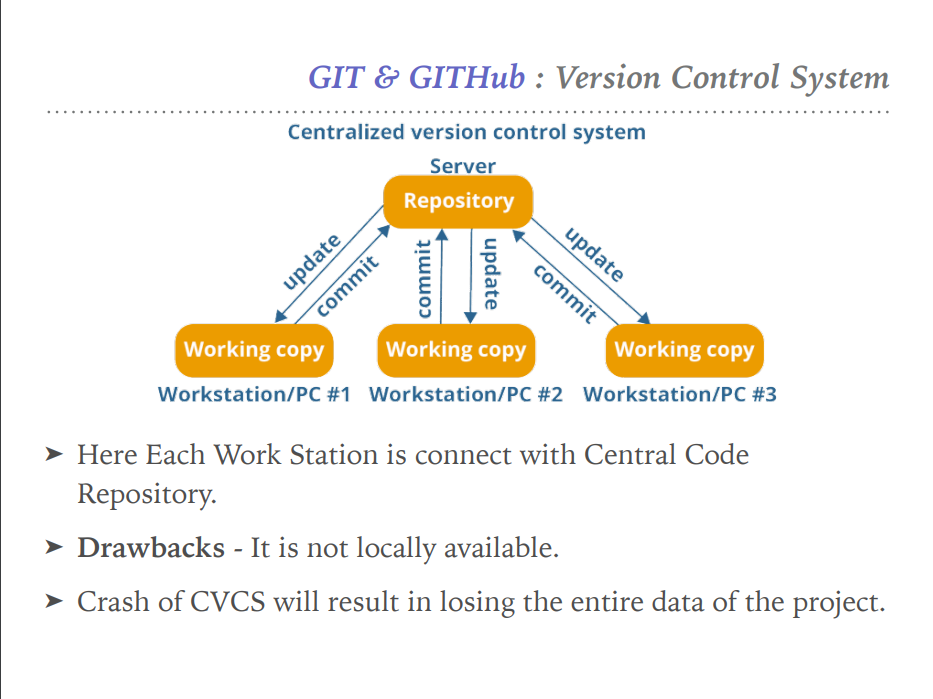
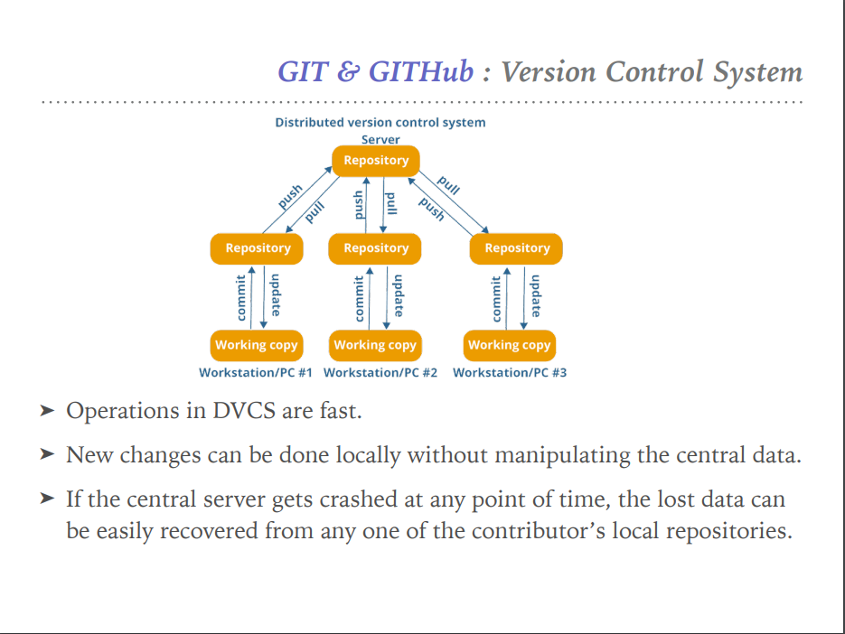
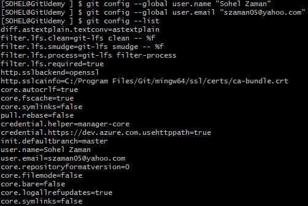
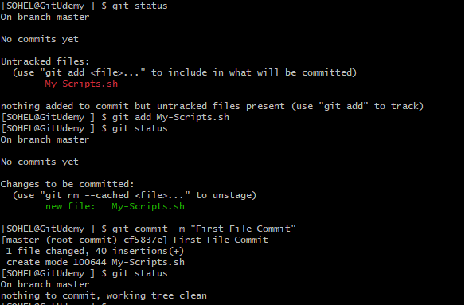
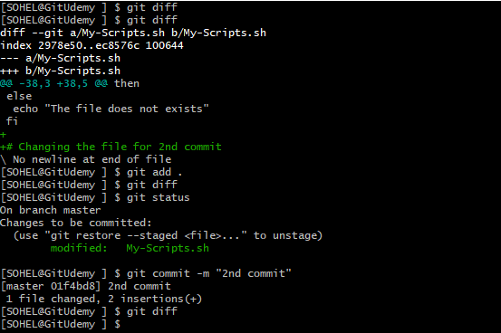
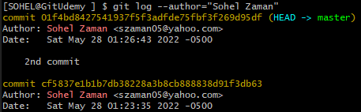

# **GIT and GITHUB NOTES**

There are 2 types of Version Control System (VCS)

-   Centralized

>  style="width:4.76609in;height:3.57049in" />

-   Distributed

    -   In Distributed VCS, every contributor has a local copy or
        “clone” of the main repository.

    -   User can change and commit local Repo without any interference.

    -   User can update their local Repo from the Central Server.

    -   User can update the Central Server from their Repo.

>  style="width:4.80649in;height:3.60897in" />

**<u>User Configuration:</u>**

$ git config --global user.name "Sohel Zaman"

$ git config --global user.email "szaman05@yahoo.com"

$ git config --list

**<u>Create Repo:</u>**

$ git init

Initialized empty Git repository in D:/Mithun Videos/3-
Git-Github/GitUdemy/.git/

$ ls -a

./ ../ .git/

Git Commit:

Git Log:

Q: How can you identify the commits from any specific dev?

A: $ git log --author="Sohel Zaman"

Create Repo From Git CLI:

gh repo create
